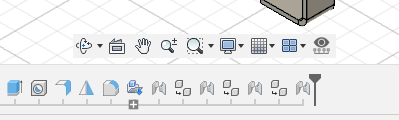

# Timeline and Viewport Sketch Visibility Toggle for Autodesk Fusion
A vibe coded Autodesk Fusion / Fusion360 add in which allows you to toggle sketch visibility from a timeline or viewport selection


[DemoVideo.webm](https://github.com/user-attachments/assets/8b8db5a6-ace7-4474-909a-f767dca2c53a)


## Overview
Gone are the days of scrolling through long lists of sketches in the browser folder to toggle visibility, this add-in provides two new functions:
1. **Toggle Selected Sketch's Visibility From the Timeline**
    - Select sketch(s) within on the timeline and toggle their visibility on/off (no visit to the browser folder required) 
2. **Toggle Selected Sketch's Visibility From the Viewport**
    - Select a sketch line/circle/arc within the viewport and toggle the parent sketch's visibility on/off
3. **Bonus - Toggle Selected Sketch's Visitility From the Browser**
    - This tool can also toggle sketches from the browser, replicating the functionality of fusion's built in visibility toggle

All functions are achieved through the same action, for which a button (  ) is added to the Navigation Toolbar at the bottom of the viewport window:

 

A keyboard Shortcut can also be added, albeit through a slightly different method to the usual process (method detailed under 'Usage') 


## Installation

1. Copy the `TimelineSketchVisibilityToggle` folder into your Fusion 360 add-ins directory:
   - **Windows**: `%appdata%\Autodesk\Autodesk Fusion 360\API\AddIns\`
   - **Mac**: `~/Library/Application Support/Autodesk/Autodesk Fusion 360/API/AddIns/`
2. In Fusion, go to **Utilities > Scripts and Add-Ins**
3. Find "TimelineSketchVisibilityToggle" and click **"Run"**
4. (optional) in Utilities > Scripts and Add-Ins mark the add in to **Run On Startup**


## Usage
1. Select sketch(s) from the timeline browser, and viewport 
2. Click the button in the nav toolbar or press your keyboard shortcut
3. Visibility of Sketch(s) will be toggled

### Finding the Button In The Navigation Toolbar
Look for the  button in the Navigation Toolbar:


### Adding A Keyboard Shortcut
Until Fusion adds a way to control keyboard shortcuts from a central place, choosing to place the button in the nav toolbar comes with the sarifice of having to follow a slighly different process to add a keyboard shortcut:
1. Display the 'Text Commands' box
2. On the right of the text commands box, ensure you have selected 'Txt'
2. Enter the following command and hit enter
```
hotkey.dialog TimelineSketchVisibilityToggle
```
3. In the resulting 'Change Keyboard Shortcut' dialog, choose your desired shotcut. 
    - DO NOT CHOOSE "V", this tool cannot replace the full functionality of the original visibility tool. Instead, choose something like "Shift+V"
